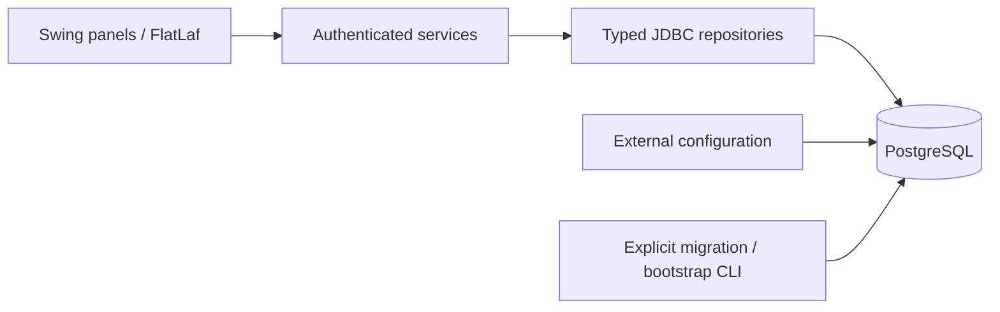

# Architecture and design

`Application` handles startup and explicit operator commands; `MainFrame` owns navigation and the current opaque session. UI workers perform JDBC and password hashing off the Swing event thread. A single shell replaces chains of hidden top-level windows. Dialogs are disposed after use. Stale search results are ignored with request generations.

| Package | Responsibility |
|---|---|
| `config` | Environment/properties config, connection creation, transaction boundary, versioned migration, optional demo installation and legacy staging |
| `model` | Immutable records, explicit roles and finite lifecycle states |
| `repository` | Bound JDBC queries, typed row mapping and reports; scoped statements/results |
| `service` | Authentication/session ownership, validation, role checks and atomic business operations |
| `ui` | Shared theme/components, forms, role navigation, tables/cards, loading/error feedback |
| `util` | Validation, password hashing, portable images and safe CSV output |

No connection pool or ORM is needed for this small desktop application. Each operation opens a short-lived connection and uses try-with-resources. Transactions roll back on checked SQL errors and domain exceptions. Connection/query timeouts bound common failures.

## Consistency rules

- Registration cannot choose an ADMIN role. Sessions are created only by successful authentication and expire after eight hours; logout invalidates them. Every protected service operation re-reads active status and role.
- Passwords are hashed with independent salts. Five failed attempts lock an account for five minutes. Changing a password invalidates other sessions in this running process. Session state is not shared between separate application processes.
- Pet edits use an integer version to detect stale writes. Archive retains history and closes pending applications. Adopted status changes require the adoption workflow.
- Application approval, withdrawal and archive consistently lock the pet before the application. Competing approvals serialize on that row. A unique pet/adoption constraint is a second line of defense.
- The database enforces one pending application per user and one active application per user/pet pair. Supply adjustments lock the inventory row, validate the resulting quantity, and write the balance and movement ledger in the same transaction.
- Reports read saved data. Receipts are scoped to their adopter or an administrator. CSV fields are quoted and spreadsheet formula prefixes neutralized. Exports use a file chooser with overwrite confirmation.

## Design system

Forest green `#234E3F`, warm ivory `#F7F6F0`, ink `#24312B`, muted text `#606F66`, white cards, terracotta accent `#BA6D4D`; error `#A23535`, success `#2C714B`, warning `#92651A`. Layout spacing uses 8–12 px small gaps, 16–24 px grouping and 30–40 px page margins. Typography is 14 px body, 21–26 px sections, 30–42 px hero/brand. Inputs have visible labels, keyboard focus and accessible names; tables are non-editable unless an explicit editor opens.

The old five-week/male-only puppy text was presentation content, not a verified per-pet eligibility system. New records store actual/estimated birth dates, sex and care descriptions. The enforceable legacy one-at-a-time application policy is retained. Shelter-specific medical/eligibility decisions remain a staff review responsibility; the software does not invent them.
