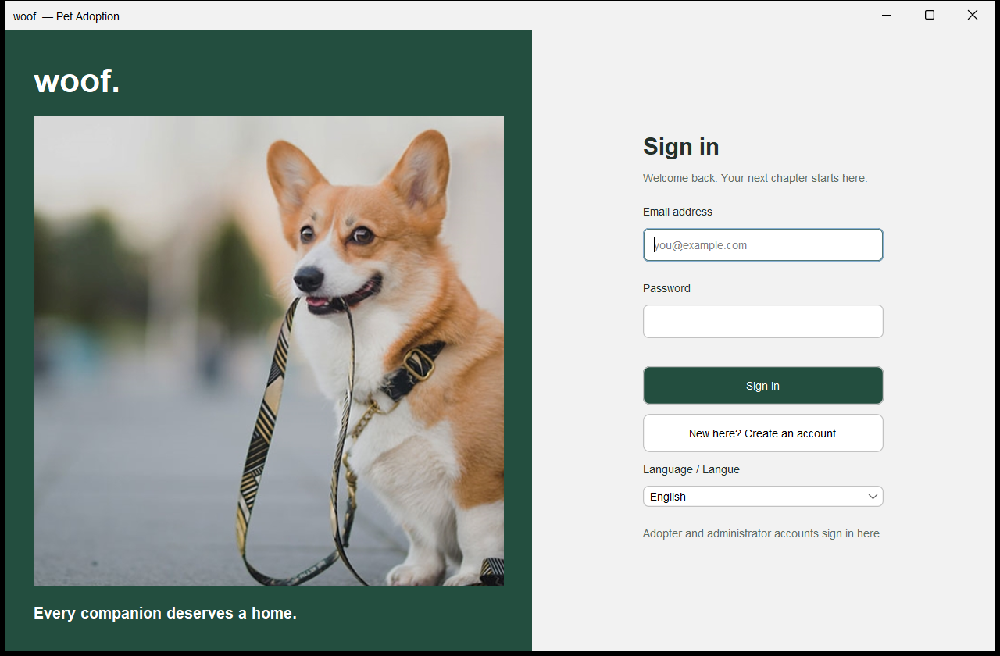
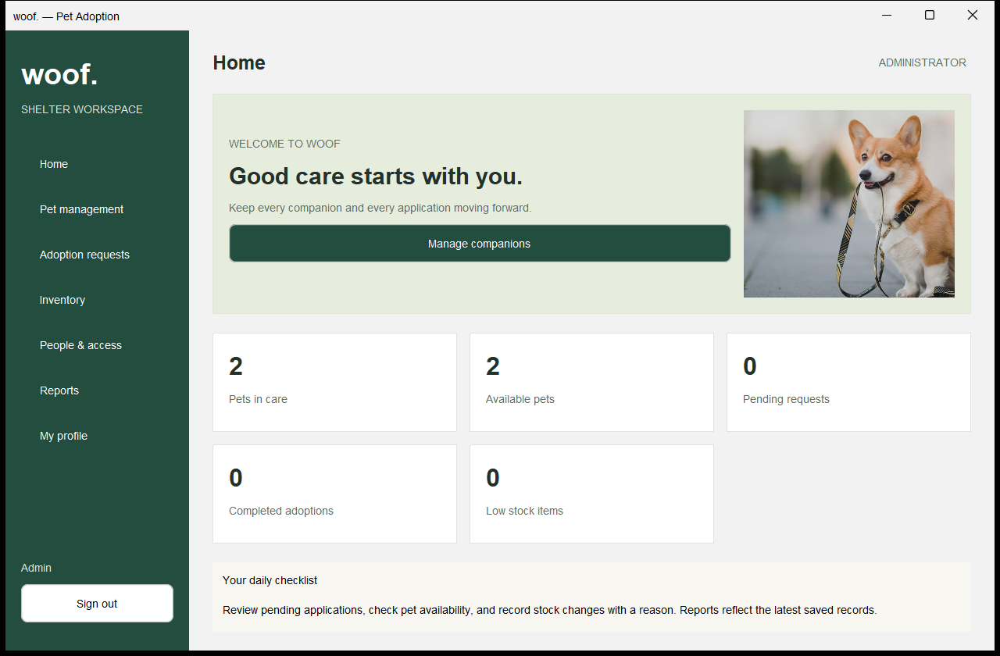
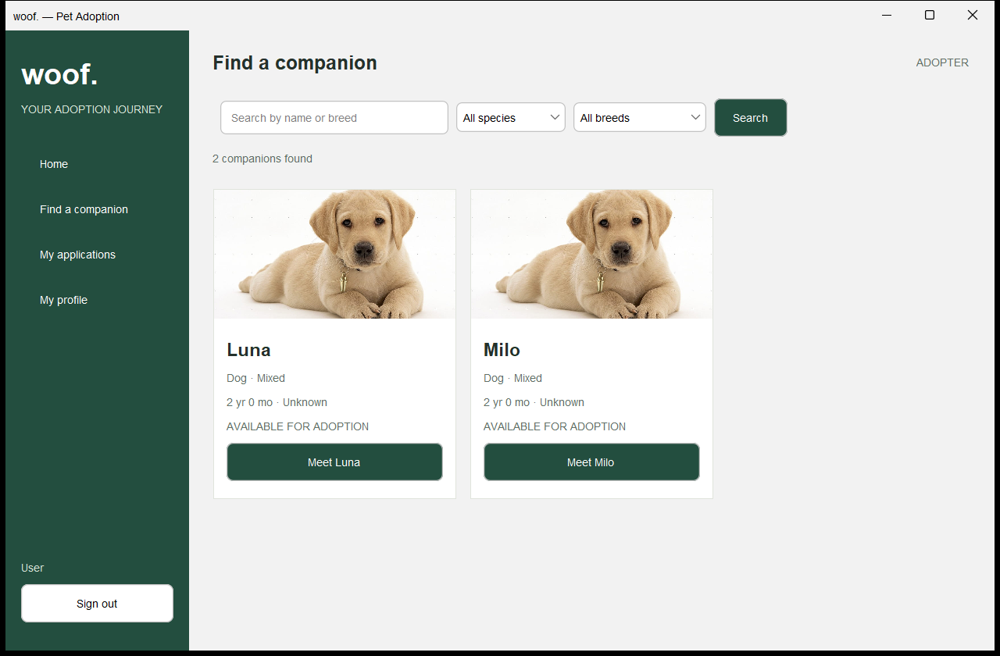
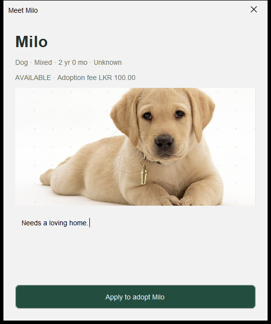
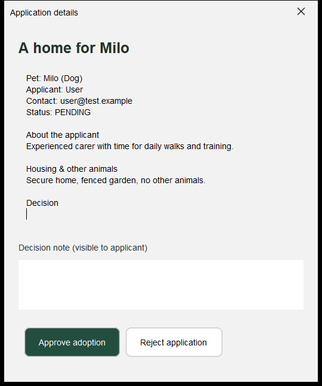
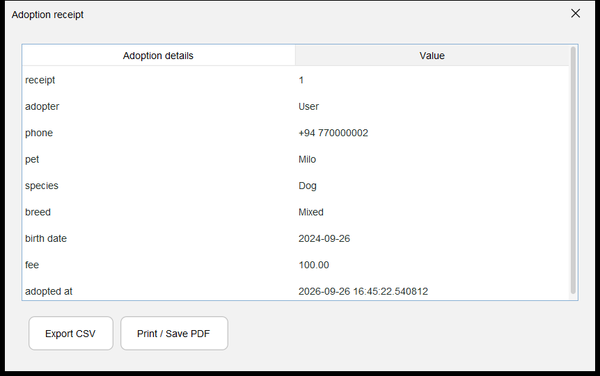

# UI review captures

These images show real Swing screens backed by an isolated PostgreSQL test database. Names and counts are test fixtures; production screens query their configured database. Full captures (20 states) are available locally under `.local/screenshots`.

## Sign in

## Administrator dashboard

## Pet browsing

## Pet details

## Application review

## Adoption receipt

